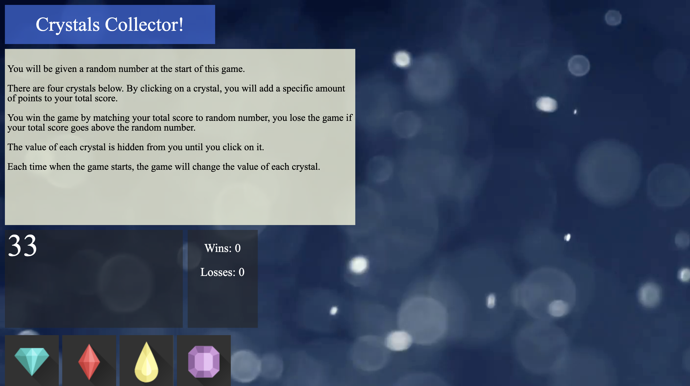

# Crystal Collector Game

Insturction:

1. You will be given a random number at the start of this game.
2. There are four crystals below. By clicking on a crystal, you will add a specific amount of points to your total score.
3. You win the game by matching your total score to random number, you lose the game if your total score goes above the random number.
4. The value of each crystal is hidden from you until you click on it.
5. Each time when the game starts, the game will change the value of each crystal.
6. You wins if the total score matches the random number from the beginning of the game
7. You losses if the the score goes above the random number
8. The random number shown at the start of the game should be between 19-120.
8. each crystal have a random hidden value 1 - 12
9. Enjoy!
